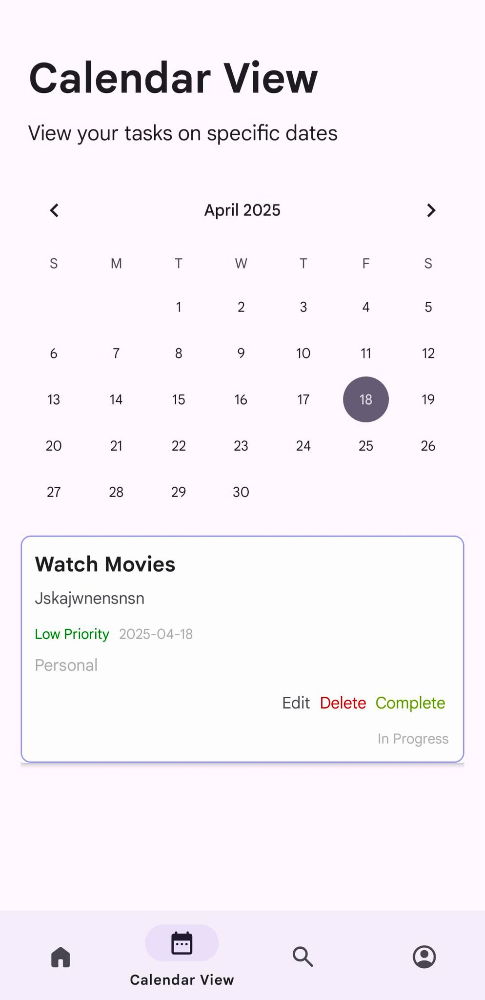
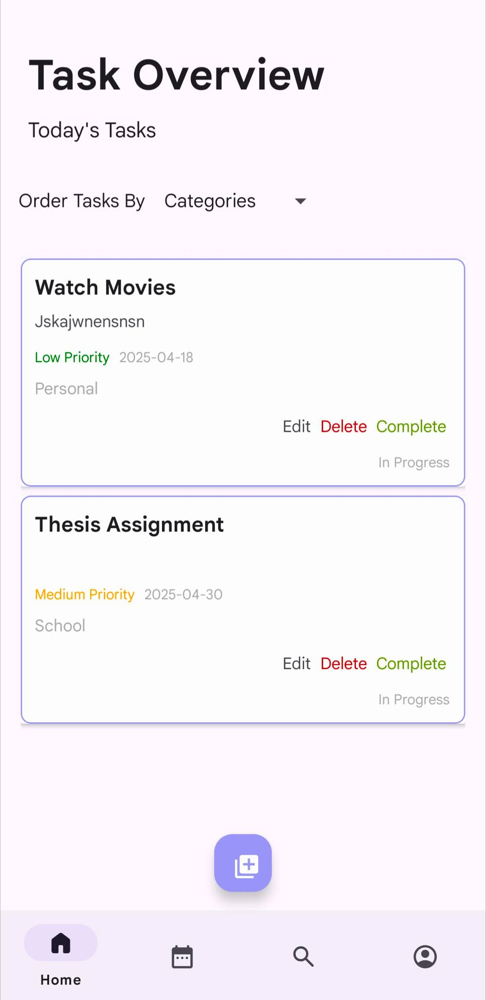

# Taskly 🗂️

**Taskly** is a simple To-Do application built with **java**.  It features core **CRUD (Create, Read, Update, Delete)** functionality and a user-friendly interface for organizing your daily activities.

## ✨ Features

- 📋 Add, view, update, and delete tasks
- 📆 Calendar view for visual task scheduling
- 🗂️ Task overview panel to keep everything in check
- 🎯 Minimalist design with intuitive navigation

## 📸 Screenshots

<div align="center">
  
  
  
</div>

## 🚀 Getting Started

1. Clone the repository:
   ```bash
   git clone https://github.com/yourusername/taskly.git
